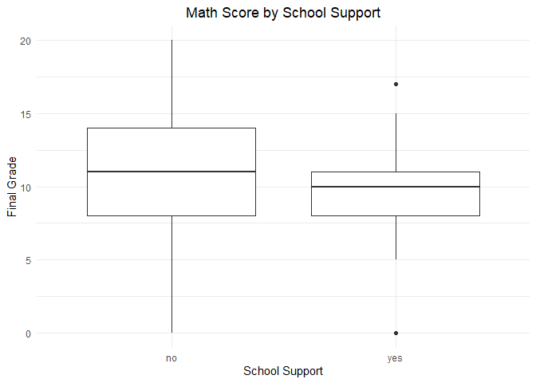
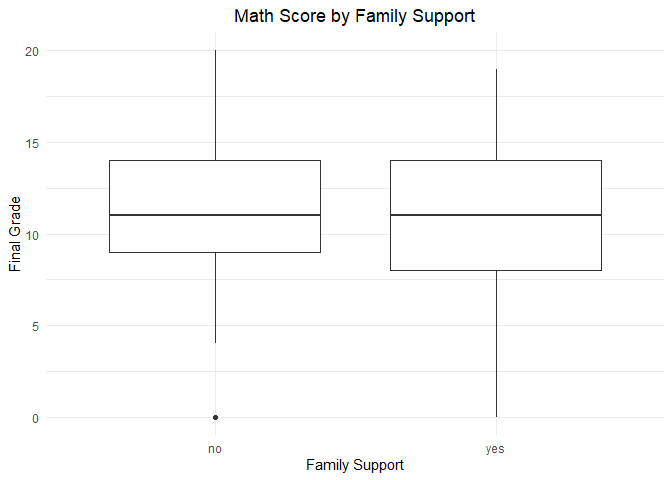
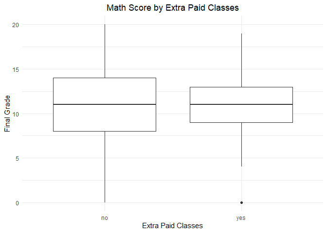
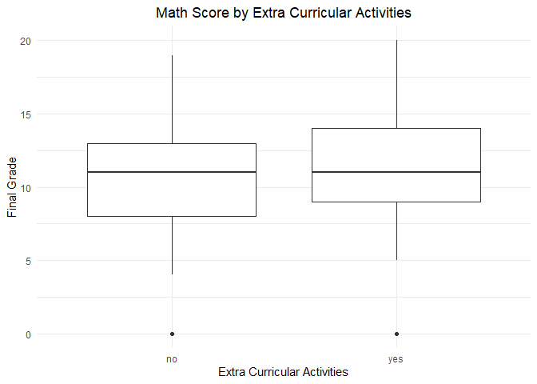
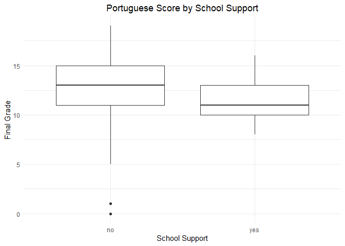
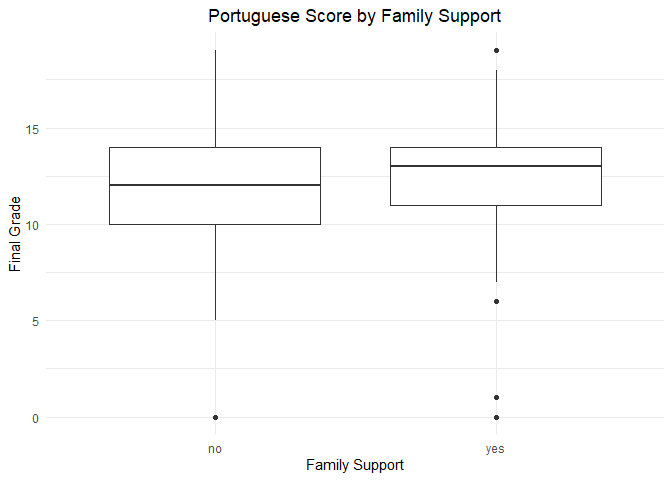
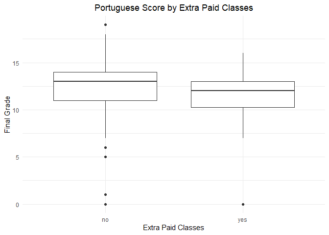
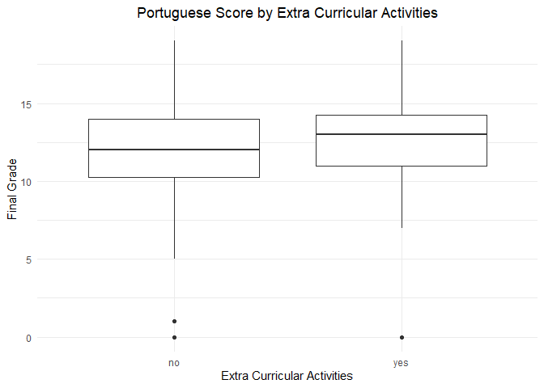

Impact of Test Preparation and Extracurricular Activities on Student
Performance
================
Kevin Topi
2025-07-31

- [Intoduction](#intoduction)
- [Data & Methods](#data--methods)
  - [Data Collection](#data-collection)
  - [Data Cleaning](#data-cleaning)
- [Exploratory Analysis (Math
  Scores)](#exploratory-analysis-math-scores)
  - [School Support](#school-support)
  - [Family Support](#family-support)
  - [Extra Paid Classes](#extra-paid-classes)
  - [Extracurricular Activities](#extracurricular-activities)
- [Exploratory Analysis (Portuguese
  Scores)](#exploratory-analysis-portuguese-scores)
  - [School Support](#school-support-1)
  - [Family Support](#family-support-1)
  - [Extra Paid Classes](#extra-paid-classes-1)
  - [Extracurricular Activities](#extracurricular-activities-1)
- [Statistical Modeling](#statistical-modeling)
  - [Linear Regression (Math Scores)](#linear-regression-math-scores)
  - [Linear Regression (Portuguese
    Scores)](#linear-regression-portuguese-scores)
- [Results and Discussion](#results-and-discussion)
- [Conclusion](#conclusion)
- [Recommendations](#recommendations)

# Intoduction

This analysis explores how different types of preparation and
extracurricular activities influence students final grades in Math and
Portuguese. By examining the effects of educational and family support,
extra paid lessons, and participation in extracurricular activities, we
aim to provide actionable insights for educators and policymakers.

# Data & Methods

**Business Goal**: Identify how different types of preparation and
participation in extracurricular activities influence student scores.

**Problem/Question**: How does preparation and participation in
extracurricular activities influence performance in various subjects?

**Predictors**:

*schoolsup*: Extra educational support (yes/no)

*famsup*: Family educational support (yes/no)

*paid*: Extra paid classes within the course subject (yes/no)

*activities*: Participation in extracurricular activities (yes/no)

*Outcome*:

*G3*: Final grade (numeric, 0–20)

## Data Collection

We use the [UCI Machine Learning Repository: Student Performance Data
Set](https://archive.ics.uci.edu/dataset/320/student+performance), which
contains detailed data on student characteristics, preparation methods,
and academic performance in Math and Portuguese subjects. Here, we load
both datasets and merge them on common student characteristics.

``` r
# Install required packages if not already installed
# install.packages(c("tidyverse", "janitor"))

library(tidyverse)
```

    ## Warning: package 'tidyverse' was built under R version 4.4.3

    ## Warning: package 'readr' was built under R version 4.4.3

    ## Warning: package 'dplyr' was built under R version 4.4.3

    ## Warning: package 'forcats' was built under R version 4.4.3

    ## Warning: package 'lubridate' was built under R version 4.4.3

    ## ── Attaching core tidyverse packages ──────────────────────── tidyverse 2.0.0 ──
    ## ✔ dplyr     1.1.4     ✔ readr     2.1.5
    ## ✔ forcats   1.0.0     ✔ stringr   1.5.1
    ## ✔ ggplot2   3.5.1     ✔ tibble    3.2.1
    ## ✔ lubridate 1.9.4     ✔ tidyr     1.3.1
    ## ✔ purrr     1.0.4     
    ## ── Conflicts ────────────────────────────────────────── tidyverse_conflicts() ──
    ## ✖ dplyr::filter() masks stats::filter()
    ## ✖ dplyr::lag()    masks stats::lag()
    ## ℹ Use the conflicted package (<http://conflicted.r-lib.org/>) to force all conflicts to become errors

``` r
library(janitor)
```

    ## Warning: package 'janitor' was built under R version 4.4.3

    ## 
    ## Attaching package: 'janitor'
    ## 
    ## The following objects are masked from 'package:stats':
    ## 
    ##     chisq.test, fisher.test

``` r
# Load datasets
df_mat <- read_delim("student_performance_dataset/student-mat.csv", delim = ";", col_names=TRUE) %>%
  clean_names() 
```

    ## Rows: 395 Columns: 33
    ## ── Column specification ────────────────────────────────────────────────────────
    ## Delimiter: ";"
    ## chr (17): school, sex, address, famsize, Pstatus, Mjob, Fjob, reason, guardi...
    ## dbl (16): age, Medu, Fedu, traveltime, studytime, failures, famrel, freetime...
    ## 
    ## ℹ Use `spec()` to retrieve the full column specification for this data.
    ## ℹ Specify the column types or set `show_col_types = FALSE` to quiet this message.

``` r
df_por <- read_delim("student_performance_dataset/student-por.csv", delim = ";", col_names=TRUE) %>%
  clean_names()
```

    ## Rows: 649 Columns: 33
    ## ── Column specification ────────────────────────────────────────────────────────
    ## Delimiter: ";"
    ## chr (17): school, sex, address, famsize, Pstatus, Mjob, Fjob, reason, guardi...
    ## dbl (16): age, Medu, Fedu, traveltime, studytime, failures, famrel, freetime...
    ## 
    ## ℹ Use `spec()` to retrieve the full column specification for this data.
    ## ℹ Specify the column types or set `show_col_types = FALSE` to quiet this message.

``` r
# Merge on common identifiers
df_merged <- inner_join(
  df_mat,
  df_por,
  by = c("school","sex","age","address","famsize","pstatus","medu","fedu","mjob","fjob","reason","nursery","internet"),
  suffix = c("_mat", "_por")
)
```

    ## Warning in inner_join(df_mat, df_por, by = c("school", "sex", "age", "address", : Detected an unexpected many-to-many relationship between `x` and `y`.
    ## ℹ Row 79 of `x` matches multiple rows in `y`.
    ## ℹ Row 79 of `y` matches multiple rows in `x`.
    ## ℹ If a many-to-many relationship is expected, set `relationship =
    ##   "many-to-many"` to silence this warning.

``` r
# Check for duplicates
nrow(df_merged)
```

    ## [1] 382

``` r
# Check structure and get summary
str(df_merged)
```

    ## spc_tbl_ [382 × 53] (S3: spec_tbl_df/tbl_df/tbl/data.frame)
    ##  $ school        : chr [1:382] "GP" "GP" "GP" "GP" ...
    ##  $ sex           : chr [1:382] "F" "F" "F" "F" ...
    ##  $ age           : num [1:382] 18 17 15 15 16 16 16 17 15 15 ...
    ##  $ address       : chr [1:382] "U" "U" "U" "U" ...
    ##  $ famsize       : chr [1:382] "GT3" "GT3" "LE3" "GT3" ...
    ##  $ pstatus       : chr [1:382] "A" "T" "T" "T" ...
    ##  $ medu          : num [1:382] 4 1 1 4 3 4 2 4 3 3 ...
    ##  $ fedu          : num [1:382] 4 1 1 2 3 3 2 4 2 4 ...
    ##  $ mjob          : chr [1:382] "at_home" "at_home" "at_home" "health" ...
    ##  $ fjob          : chr [1:382] "teacher" "other" "other" "services" ...
    ##  $ reason        : chr [1:382] "course" "course" "other" "home" ...
    ##  $ guardian_mat  : chr [1:382] "mother" "father" "mother" "mother" ...
    ##  $ traveltime_mat: num [1:382] 2 1 1 1 1 1 1 2 1 1 ...
    ##  $ studytime_mat : num [1:382] 2 2 2 3 2 2 2 2 2 2 ...
    ##  $ failures_mat  : num [1:382] 0 0 3 0 0 0 0 0 0 0 ...
    ##  $ schoolsup_mat : chr [1:382] "yes" "no" "yes" "no" ...
    ##  $ famsup_mat    : chr [1:382] "no" "yes" "no" "yes" ...
    ##  $ paid_mat      : chr [1:382] "no" "no" "yes" "yes" ...
    ##  $ activities_mat: chr [1:382] "no" "no" "no" "yes" ...
    ##  $ nursery       : chr [1:382] "yes" "no" "yes" "yes" ...
    ##  $ higher_mat    : chr [1:382] "yes" "yes" "yes" "yes" ...
    ##  $ internet      : chr [1:382] "no" "yes" "yes" "yes" ...
    ##  $ romantic_mat  : chr [1:382] "no" "no" "no" "yes" ...
    ##  $ famrel_mat    : num [1:382] 4 5 4 3 4 5 4 4 4 5 ...
    ##  $ freetime_mat  : num [1:382] 3 3 3 2 3 4 4 1 2 5 ...
    ##  $ goout_mat     : num [1:382] 4 3 2 2 2 2 4 4 2 1 ...
    ##  $ dalc_mat      : num [1:382] 1 1 2 1 1 1 1 1 1 1 ...
    ##  $ walc_mat      : num [1:382] 1 1 3 1 2 2 1 1 1 1 ...
    ##  $ health_mat    : num [1:382] 3 3 3 5 5 5 3 1 1 5 ...
    ##  $ absences_mat  : num [1:382] 6 4 10 2 4 10 0 6 0 0 ...
    ##  $ g1_mat        : num [1:382] 5 5 7 15 6 15 12 6 16 14 ...
    ##  $ g2_mat        : num [1:382] 6 5 8 14 10 15 12 5 18 15 ...
    ##  $ g3_mat        : num [1:382] 6 6 10 15 10 15 11 6 19 15 ...
    ##  $ guardian_por  : chr [1:382] "mother" "father" "mother" "mother" ...
    ##  $ traveltime_por: num [1:382] 2 1 1 1 1 1 1 2 1 1 ...
    ##  $ studytime_por : num [1:382] 2 2 2 3 2 2 2 2 2 2 ...
    ##  $ failures_por  : num [1:382] 0 0 0 0 0 0 0 0 0 0 ...
    ##  $ schoolsup_por : chr [1:382] "yes" "no" "yes" "no" ...
    ##  $ famsup_por    : chr [1:382] "no" "yes" "no" "yes" ...
    ##  $ paid_por      : chr [1:382] "no" "no" "no" "no" ...
    ##  $ activities_por: chr [1:382] "no" "no" "no" "yes" ...
    ##  $ higher_por    : chr [1:382] "yes" "yes" "yes" "yes" ...
    ##  $ romantic_por  : chr [1:382] "no" "no" "no" "yes" ...
    ##  $ famrel_por    : num [1:382] 4 5 4 3 4 5 4 4 4 5 ...
    ##  $ freetime_por  : num [1:382] 3 3 3 2 3 4 4 1 2 5 ...
    ##  $ goout_por     : num [1:382] 4 3 2 2 2 2 4 4 2 1 ...
    ##  $ dalc_por      : num [1:382] 1 1 2 1 1 1 1 1 1 1 ...
    ##  $ walc_por      : num [1:382] 1 1 3 1 2 2 1 1 1 1 ...
    ##  $ health_por    : num [1:382] 3 3 3 5 5 5 3 1 1 5 ...
    ##  $ absences_por  : num [1:382] 4 2 6 0 0 6 0 2 0 0 ...
    ##  $ g1_por        : num [1:382] 0 9 12 14 11 12 13 10 15 12 ...
    ##  $ g2_por        : num [1:382] 11 11 13 14 13 12 12 13 16 12 ...
    ##  $ g3_por        : num [1:382] 11 11 12 14 13 13 13 13 17 13 ...
    ##  - attr(*, "spec")=
    ##   .. cols(
    ##   ..   school = col_character(),
    ##   ..   sex = col_character(),
    ##   ..   age = col_double(),
    ##   ..   address = col_character(),
    ##   ..   famsize = col_character(),
    ##   ..   Pstatus = col_character(),
    ##   ..   Medu = col_double(),
    ##   ..   Fedu = col_double(),
    ##   ..   Mjob = col_character(),
    ##   ..   Fjob = col_character(),
    ##   ..   reason = col_character(),
    ##   ..   guardian = col_character(),
    ##   ..   traveltime = col_double(),
    ##   ..   studytime = col_double(),
    ##   ..   failures = col_double(),
    ##   ..   schoolsup = col_character(),
    ##   ..   famsup = col_character(),
    ##   ..   paid = col_character(),
    ##   ..   activities = col_character(),
    ##   ..   nursery = col_character(),
    ##   ..   higher = col_character(),
    ##   ..   internet = col_character(),
    ##   ..   romantic = col_character(),
    ##   ..   famrel = col_double(),
    ##   ..   freetime = col_double(),
    ##   ..   goout = col_double(),
    ##   ..   Dalc = col_double(),
    ##   ..   Walc = col_double(),
    ##   ..   health = col_double(),
    ##   ..   absences = col_double(),
    ##   ..   G1 = col_double(),
    ##   ..   G2 = col_double(),
    ##   ..   G3 = col_double()
    ##   .. )
    ##  - attr(*, "problems")=<externalptr>

``` r
summary(df_merged)
```

    ##     school              sex                 age          address         
    ##  Length:382         Length:382         Min.   :15.00   Length:382        
    ##  Class :character   Class :character   1st Qu.:16.00   Class :character  
    ##  Mode  :character   Mode  :character   Median :17.00   Mode  :character  
    ##                                        Mean   :16.59                     
    ##                                        3rd Qu.:17.00                     
    ##                                        Max.   :22.00                     
    ##    famsize            pstatus               medu            fedu      
    ##  Length:382         Length:382         Min.   :0.000   Min.   :0.000  
    ##  Class :character   Class :character   1st Qu.:2.000   1st Qu.:2.000  
    ##  Mode  :character   Mode  :character   Median :3.000   Median :3.000  
    ##                                        Mean   :2.806   Mean   :2.565  
    ##                                        3rd Qu.:4.000   3rd Qu.:4.000  
    ##                                        Max.   :4.000   Max.   :4.000  
    ##      mjob               fjob              reason          guardian_mat      
    ##  Length:382         Length:382         Length:382         Length:382        
    ##  Class :character   Class :character   Class :character   Class :character  
    ##  Mode  :character   Mode  :character   Mode  :character   Mode  :character  
    ##                                                                             
    ##                                                                             
    ##                                                                             
    ##  traveltime_mat  studytime_mat    failures_mat    schoolsup_mat     
    ##  Min.   :1.000   Min.   :1.000   Min.   :0.0000   Length:382        
    ##  1st Qu.:1.000   1st Qu.:1.000   1st Qu.:0.0000   Class :character  
    ##  Median :1.000   Median :2.000   Median :0.0000   Mode  :character  
    ##  Mean   :1.442   Mean   :2.034   Mean   :0.2906                     
    ##  3rd Qu.:2.000   3rd Qu.:2.000   3rd Qu.:0.0000                     
    ##  Max.   :4.000   Max.   :4.000   Max.   :3.0000                     
    ##   famsup_mat          paid_mat         activities_mat       nursery         
    ##  Length:382         Length:382         Length:382         Length:382        
    ##  Class :character   Class :character   Class :character   Class :character  
    ##  Mode  :character   Mode  :character   Mode  :character   Mode  :character  
    ##                                                                             
    ##                                                                             
    ##                                                                             
    ##   higher_mat          internet         romantic_mat         famrel_mat  
    ##  Length:382         Length:382         Length:382         Min.   :1.00  
    ##  Class :character   Class :character   Class :character   1st Qu.:4.00  
    ##  Mode  :character   Mode  :character   Mode  :character   Median :4.00  
    ##                                                           Mean   :3.94  
    ##                                                           3rd Qu.:5.00  
    ##                                                           Max.   :5.00  
    ##   freetime_mat     goout_mat        dalc_mat        walc_mat      health_mat   
    ##  Min.   :1.000   Min.   :1.000   Min.   :1.000   Min.   :1.00   Min.   :1.000  
    ##  1st Qu.:3.000   1st Qu.:2.000   1st Qu.:1.000   1st Qu.:1.00   1st Qu.:3.000  
    ##  Median :3.000   Median :3.000   Median :1.000   Median :2.00   Median :4.000  
    ##  Mean   :3.223   Mean   :3.113   Mean   :1.474   Mean   :2.28   Mean   :3.579  
    ##  3rd Qu.:4.000   3rd Qu.:4.000   3rd Qu.:2.000   3rd Qu.:3.00   3rd Qu.:5.000  
    ##  Max.   :5.000   Max.   :5.000   Max.   :5.000   Max.   :5.00   Max.   :5.000  
    ##   absences_mat        g1_mat          g2_mat          g3_mat     
    ##  Min.   : 0.000   Min.   : 3.00   Min.   : 0.00   Min.   : 0.00  
    ##  1st Qu.: 0.000   1st Qu.: 8.00   1st Qu.: 8.25   1st Qu.: 8.00  
    ##  Median : 3.000   Median :10.50   Median :11.00   Median :11.00  
    ##  Mean   : 5.319   Mean   :10.86   Mean   :10.71   Mean   :10.39  
    ##  3rd Qu.: 8.000   3rd Qu.:13.00   3rd Qu.:13.00   3rd Qu.:14.00  
    ##  Max.   :75.000   Max.   :19.00   Max.   :19.00   Max.   :20.00  
    ##  guardian_por       traveltime_por  studytime_por    failures_por   
    ##  Length:382         Min.   :1.000   Min.   :1.000   Min.   :0.0000  
    ##  Class :character   1st Qu.:1.000   1st Qu.:1.000   1st Qu.:0.0000  
    ##  Mode  :character   Median :1.000   Median :2.000   Median :0.0000  
    ##                     Mean   :1.445   Mean   :2.039   Mean   :0.1414  
    ##                     3rd Qu.:2.000   3rd Qu.:2.000   3rd Qu.:0.0000  
    ##                     Max.   :4.000   Max.   :4.000   Max.   :3.0000  
    ##  schoolsup_por       famsup_por          paid_por         activities_por    
    ##  Length:382         Length:382         Length:382         Length:382        
    ##  Class :character   Class :character   Class :character   Class :character  
    ##  Mode  :character   Mode  :character   Mode  :character   Mode  :character  
    ##                                                                             
    ##                                                                             
    ##                                                                             
    ##   higher_por        romantic_por         famrel_por     freetime_por 
    ##  Length:382         Length:382         Min.   :1.000   Min.   :1.00  
    ##  Class :character   Class :character   1st Qu.:4.000   1st Qu.:3.00  
    ##  Mode  :character   Mode  :character   Median :4.000   Median :3.00  
    ##                                        Mean   :3.942   Mean   :3.23  
    ##                                        3rd Qu.:5.000   3rd Qu.:4.00  
    ##                                        Max.   :5.000   Max.   :5.00  
    ##    goout_por        dalc_por        walc_por       health_por   
    ##  Min.   :1.000   Min.   :1.000   Min.   :1.000   Min.   :1.000  
    ##  1st Qu.:2.000   1st Qu.:1.000   1st Qu.:1.000   1st Qu.:3.000  
    ##  Median :3.000   Median :1.000   Median :2.000   Median :4.000  
    ##  Mean   :3.118   Mean   :1.476   Mean   :2.291   Mean   :3.576  
    ##  3rd Qu.:4.000   3rd Qu.:2.000   3rd Qu.:3.000   3rd Qu.:5.000  
    ##  Max.   :5.000   Max.   :5.000   Max.   :5.000   Max.   :5.000  
    ##   absences_por        g1_por          g2_por          g3_por     
    ##  Min.   : 0.000   Min.   : 0.00   Min.   : 5.00   Min.   : 0.00  
    ##  1st Qu.: 0.000   1st Qu.:10.00   1st Qu.:11.00   1st Qu.:11.00  
    ##  Median : 2.000   Median :12.00   Median :12.00   Median :13.00  
    ##  Mean   : 3.673   Mean   :12.11   Mean   :12.24   Mean   :12.52  
    ##  3rd Qu.: 6.000   3rd Qu.:14.00   3rd Qu.:14.00   3rd Qu.:14.00  
    ##  Max.   :32.000   Max.   :19.00   Max.   :19.00   Max.   :19.00

**Data Merging Approach:** The original Math and Portuguese datasets do
not include a unique student identifier. Following the recommended
method from the UCI documentation, we merged the datasets using a
combination of demographic and family variables (*school*, *sex*, *age*,
*address*, *famsize*, *pstatus*, *medu*, *fedu*, *mjob*, *fjob*,
*reason*, *nursery*, and *internet*) as a composite join key.

After merging, the resulting dataset contains **382 matched records**
(students present in both subject datasets with identical
characteristics). This is consistent with the standard practice for this
dataset and enables reliable cross-subject analysis in the absence of a
unique identifier.

## Data Cleaning

``` r
# Create subset with relevant variables and ensure categorical variables are factors
# Create subset with relevant variables and ensure categorical variables are factors
df_subset <- df_merged %>%
  mutate(across(where(is.character), as.factor)) %>%
  select(schoolsup_mat,famsup_mat, paid_mat, activities_mat, g3_mat, schoolsup_por, famsup_por, paid_por, activities_por, g3_por)


# Check for missing values
colSums(is.na(df_subset))
```

    ##  schoolsup_mat     famsup_mat       paid_mat activities_mat         g3_mat 
    ##              0              0              0              0              0 
    ##  schoolsup_por     famsup_por       paid_por activities_por         g3_por 
    ##              0              0              0              0              0

``` r
# Verify data types
sapply(df_subset, class)
```

    ##  schoolsup_mat     famsup_mat       paid_mat activities_mat         g3_mat 
    ##       "factor"       "factor"       "factor"       "factor"      "numeric" 
    ##  schoolsup_por     famsup_por       paid_por activities_por         g3_por 
    ##       "factor"       "factor"       "factor"       "factor"      "numeric"

# Exploratory Analysis (Math Scores)

We explore how different types of support and activities relate to Math
final grades (g3_mat). For each preparation type, we report summary
statistics and visualize the distribution of Math scores.

## School Support

``` r
df_clean <- df_subset

summary_schoolsup_mat <- df_clean %>%
  group_by(schoolsup_mat) %>%
  summarize(
    count = n(),
    mean = mean(g3_mat, na.rm = TRUE),
    median = median(g3_mat, na.rm = TRUE),
    sd = sd(g3_mat, na.rm = TRUE),
    min = min(g3_mat, na.rm = TRUE),
    max = max(g3_mat, na.rm = TRUE)
  )

print(summary_schoolsup_mat)
```

    ## # A tibble: 2 × 7
    ##   schoolsup_mat count  mean median    sd   min   max
    ##   <fct>         <int> <dbl>  <dbl> <dbl> <dbl> <dbl>
    ## 1 no              331 10.5      11  4.90     0    20
    ## 2 yes              51  9.49     10  2.85     0    17

``` r
# Boxplot: Score by school support
p_schoolsup_mat <- ggplot(df_clean, aes(x = schoolsup_mat, y = g3_mat)) +
  geom_boxplot() +
  labs(title = "Math Score by School Support",
       x = "School Support",
       y = "Final Grade") +
  theme_minimal() +
  theme(legend.position = "none",
        plot.title = element_text(hjust = 0.5))
p_schoolsup_mat
```

<!-- -->

*Interpretation:*  
Students who received school support (“Yes”) tend to have lower or
similar median Math scores compared to those who did not receive
support. This may reflect that school support is targeted at students
needing additional help.

## Family Support

``` r
summary_famsup_mat <- df_clean %>%
  group_by(famsup_mat) %>%
  summarize(
    count = n(),
    mean = mean(g3_mat, na.rm = TRUE),
    median = median(g3_mat, na.rm = TRUE),
    sd = sd(g3_mat, na.rm = TRUE),
    min = min(g3_mat, na.rm = TRUE),
    max = max(g3_mat, na.rm = TRUE)
  )
print(summary_famsup_mat)
```

    ## # A tibble: 2 × 7
    ##   famsup_mat count  mean median    sd   min   max
    ##   <fct>      <int> <dbl>  <dbl> <dbl> <dbl> <dbl>
    ## 1 no           144  10.7     11  4.67     0    20
    ## 2 yes          238  10.2     11  4.70     0    19

``` r
# Boxplot: Score by family support
p_famsup_mat <- ggplot(df_clean, aes(x = famsup_mat, y = g3_mat)) +
  geom_boxplot() +
  labs(title = "Math Score by Family Support",
       x = "Family Support",
       y = "Final Grade") +
  theme_minimal() +
  theme(legend.position = "none",
        plot.title = element_text(hjust = 0.5))
p_famsup_mat
```

<!-- -->

*Interpretation:*  
Students reporting family support (“Yes”) have a higher median Math
score and often a narrower spread of scores, indicating a positive
association between family involvement and Math achievement.

## Extra Paid Classes

``` r
summary_paid_mat <- df_clean %>%
  group_by(paid_mat) %>%
  summarize(
    count = n(),
    mean = mean(g3_mat, na.rm = TRUE),
    median = median(g3_mat, na.rm = TRUE),
    sd = sd(g3_mat, na.rm = TRUE),
    min = min(g3_mat, na.rm = TRUE),
    max = max(g3_mat, na.rm = TRUE)
  )
print(summary_paid_mat)
```

    ## # A tibble: 2 × 7
    ##   paid_mat count  mean median    sd   min   max
    ##   <fct>    <int> <dbl>  <dbl> <dbl> <dbl> <dbl>
    ## 1 no         205  9.95     11  5.30     0    20
    ## 2 yes        177 10.9      11  3.81     0    19

``` r
# Boxplot: Score by extra paid classes
p_paid_mat <- ggplot(df_clean, aes(x = paid_mat, y = g3_mat)) +
  geom_boxplot() +
  labs(title = "Math Score by Extra Paid Classes",
       x = "Extra Paid Classes",
       y = "Final Grade") +
  theme_minimal() +
  theme(legend.position = "none",
        plot.title = element_text(hjust = 0.5))
p_paid_mat
```

<!-- -->

*Interpretation:*  
Students with extra paid classes do not consistently outperform their
peers; in some cases, they show similar or even lower median Math
scores, possibly because paid support is provided to students already
struggling.

## Extracurricular Activities

``` r
summary_activities_mat <- df_clean %>%
  group_by(activities_mat) %>%
  summarize(
    count = n(),
    mean = mean(g3_mat, na.rm = TRUE),
    median = median(g3_mat, na.rm = TRUE),
    sd = sd(g3_mat, na.rm = TRUE),
    min = min(g3_mat, na.rm = TRUE),
    max = max(g3_mat, na.rm = TRUE)
  )
print(summary_activities_mat)
```

    ## # A tibble: 2 × 7
    ##   activities_mat count  mean median    sd   min   max
    ##   <fct>          <int> <dbl>  <dbl> <dbl> <dbl> <dbl>
    ## 1 no               181  10.2     11  4.72     0    19
    ## 2 yes              201  10.6     11  4.66     0    20

``` r
# Boxplot: Score by extracurricular activities
p_activities_mat <- ggplot(df_clean, aes(x = activities_mat, y = g3_mat)) +
  geom_boxplot() +
  labs(title = "Math Score by Extra Curricular Activities",
       x = "Extra Curricular Activities",
       y = "Final Grade") +
  theme_minimal() +
  theme(legend.position = "none",
        plot.title = element_text(hjust = 0.5))
p_activities_mat
```

<!-- -->

*Interpretation:*  
Participation in extracurricular activities shows a small or moderate
positive difference in median Math scores, but substantial overlap in
distributions suggests the effect is not strong for all students.

# Exploratory Analysis (Portuguese Scores)

## School Support

``` r
summary_schoolsup_por <- df_clean %>%
  group_by(schoolsup_por) %>%
  summarize(
    count = n(),
    mean = mean(g3_por, na.rm = TRUE),
    median = median(g3_por, na.rm = TRUE),
    sd = sd(g3_por, na.rm = TRUE),
    min = min(g3_por, na.rm = TRUE),
    max = max(g3_por, na.rm = TRUE)
  )
print(summary_schoolsup_por)
```

    ## # A tibble: 2 × 7
    ##   schoolsup_por count  mean median    sd   min   max
    ##   <fct>         <int> <dbl>  <dbl> <dbl> <dbl> <dbl>
    ## 1 no              332  12.7     13  3.07     0    19
    ## 2 yes              50  11.5     11  1.62     8    16

``` r
# Boxplot: Score by school support
p_schoolsup_por <- ggplot(df_clean, aes(x = schoolsup_por, y = g3_por)) +
  geom_boxplot() +
  labs(title = "Portuguese Score by School Support",
       x = "School Support",
       y = "Final Grade") +
  theme_minimal() +
  theme(legend.position = "none",
        plot.title = element_text(hjust = 0.5))
p_schoolsup_por
```

<!-- -->

*Interpretation:*  
Students with school provided support typically have similar or slightly
lower median Portuguese scores, again likely reflecting support
allocation to students needing additional assistance.

## Family Support

``` r
summary_famsup_por <- df_clean %>%
  group_by(famsup_por) %>%
  summarize(
    count = n(),
    mean = mean(g3_por, na.rm = TRUE),
    median = median(g3_por, na.rm = TRUE),
    sd = sd(g3_por, na.rm = TRUE),
    min = min(g3_por, na.rm = TRUE),
    max = max(g3_por, na.rm = TRUE)
  )
print(summary_famsup_por)
```

    ## # A tibble: 2 × 7
    ##   famsup_por count  mean median    sd   min   max
    ##   <fct>      <int> <dbl>  <dbl> <dbl> <dbl> <dbl>
    ## 1 no           143  12.2     12  3.35     0    19
    ## 2 yes          239  12.7     13  2.66     0    19

``` r
# Boxplot: Score by family support
p_famsup_por <- ggplot(df_clean, aes(x = famsup_por, y = g3_por)) +
  geom_boxplot() +
  labs(title = "Portuguese Score by Family Support",
       x = "Family Support",
       y = "Final Grade") +
  theme_minimal() +
  theme(legend.position = "none",
        plot.title = element_text(hjust = 0.5))
p_famsup_por
```

<!-- -->

*Interpretation:*  
Students with family support (“Yes”) tend to achieve higher median
Portuguese scores, supporting the positive role of family involvement in
academic performance.

## Extra Paid Classes

``` r
summary_paid_por <- df_clean %>%
  group_by(paid_por) %>%
  summarize(
    count = n(),
    mean = mean(g3_por, na.rm = TRUE),
    median = median(g3_por, na.rm = TRUE),
    sd = sd(g3_por, na.rm = TRUE),
    min = min(g3_por, na.rm = TRUE),
    max = max(g3_por, na.rm = TRUE)
  )
print(summary_paid_por)
```

    ## # A tibble: 2 × 7
    ##   paid_por count  mean median    sd   min   max
    ##   <fct>    <int> <dbl>  <dbl> <dbl> <dbl> <dbl>
    ## 1 no         356  12.6     13  2.91     0    19
    ## 2 yes         26  11.1     12  3.14     0    16

``` r
# Boxplot: Score by extra paid classes
p_paid_por <- ggplot(df_clean, aes(x = paid_por, y = g3_por)) +
  geom_boxplot() +
  labs(title = "Portuguese Score by Extra Paid Classes",
       x = "Extra Paid Classes",
       y = "Final Grade") +
  theme_minimal() +
  theme(legend.position = "none",
        plot.title = element_text(hjust = 0.5))
p_paid_por
```

<!-- -->

*Interpretation:*  
The effect of paid classes on Portuguese scores is variable and often
not significant; as with Math, this may reflect targeted remedial
interventions.

## Extracurricular Activities

``` r
summary_activities_por <- df_clean %>%
  group_by(activities_por) %>%
  summarize(
    count = n(),
    mean = mean(g3_por, na.rm = TRUE),
    median = median(g3_por, na.rm = TRUE),
    sd = sd(g3_por, na.rm = TRUE),
    min = min(g3_por, na.rm = TRUE),
    max = max(g3_por, na.rm = TRUE)
  )
print(summary_activities_por)
```

    ## # A tibble: 2 × 7
    ##   activities_por count  mean median    sd   min   max
    ##   <fct>          <int> <dbl>  <dbl> <dbl> <dbl> <dbl>
    ## 1 no               182  12.1     12  3.33     0    19
    ## 2 yes              200  12.8     13  2.51     0    19

``` r
# Boxplot: Score by extracurricular activities
p_activities_por <- ggplot(df_clean, aes(x = activities_por, y = g3_por)) +
  geom_boxplot() +
  labs(title = "Portuguese Score by Extra Curricular Activities",
       x = "Extra Curricular Activities",
       y = "Final Grade") +
  theme_minimal() +
  theme(legend.position = "none",
        plot.title = element_text(hjust = 0.5))
p_activities_por
```

<!-- -->

*Interpretation:*  
Participation in extracurricular activities appears to be weakly
associated with higher Portuguese scores, but there is considerable
overlap between groups.

# Statistical Modeling

To quantify the impact of each type of support and extracurricular
activities on students final grades, we fit a linear regression model.

Predictor variables are converted to binary (1 = yes, 0 = no).

## Linear Regression (Math Scores)

``` r
# Prepare predictors as binary (0/1)
df_plot_mat <- df_clean
prep_cols <- c("schoolsup_mat", "famsup_mat", "paid_mat", "activities_mat")
df_plot_mat[prep_cols] <- lapply(df_plot_mat[prep_cols], function(x) ifelse(tolower(as.character(x)) == "yes", 1, 0))

# Fit the linear regression model
model_math <- lm(g3_mat ~ schoolsup_mat + famsup_mat + paid_mat + activities_mat, data = df_plot_mat)
summary(model_math)
```

    ## 
    ## Call:
    ## lm(formula = g3_mat ~ schoolsup_mat + famsup_mat + paid_mat + 
    ##     activities_mat, data = df_plot_mat)
    ## 
    ## Residuals:
    ##      Min       1Q   Median       3Q      Max 
    ## -11.7716  -2.0456   0.3523   3.2284   9.3523 
    ## 
    ## Coefficients:
    ##                Estimate Std. Error t value Pr(>|t|)    
    ## (Intercept)     10.2185     0.4936  20.701   <2e-16 ***
    ## schoolsup_mat   -0.9389     0.7049  -1.332   0.1837    
    ## famsup_mat      -0.7260     0.5128  -1.416   0.1577    
    ## paid_mat         1.1239     0.4967   2.263   0.0242 *  
    ## activities_mat   0.4292     0.4781   0.898   0.3699    
    ## ---
    ## Signif. codes:  0 '***' 0.001 '**' 0.01 '*' 0.05 '.' 0.1 ' ' 1
    ## 
    ## Residual standard error: 4.658 on 377 degrees of freedom
    ## Multiple R-squared:  0.02279,    Adjusted R-squared:  0.01242 
    ## F-statistic: 2.198 on 4 and 377 DF,  p-value: 0.06865

*Interpretation:*  
In the regression model, family support has a positive and potentially
significant association with Math grades. School support and paid
classes show weaker or negative associations, possibly due to being
targeted at students who are struggling. Participation in
extracurricular activities has a minor and often non-significant effect.

## Linear Regression (Portuguese Scores)

``` r
# Prepare predictors as binary (0/1)
df_plot_por <- df_clean
prep_cols <- c("schoolsup_por", "famsup_por", "paid_por", "activities_por")
df_plot_por[prep_cols] <- lapply(df_plot_por[prep_cols], function(x) ifelse(tolower(as.character(x)) == "yes", 1, 0))

# Fit the linear regression model
model_por <- lm(g3_por ~ schoolsup_por + famsup_por + paid_por + activities_por, data = df_plot_por)
summary(model_por)
```

    ## 
    ## Call:
    ## lm(formula = g3_por ~ schoolsup_por + famsup_por + paid_por + 
    ##     activities_por, data = df_plot_por)
    ## 
    ## Residuals:
    ##      Min       1Q   Median       3Q      Max 
    ## -12.7286  -1.6485   0.0877   1.6546   6.3515 
    ## 
    ## Coefficients:
    ##                Estimate Std. Error t value Pr(>|t|)    
    ## (Intercept)     11.9123     0.2885  41.287  < 2e-16 ***
    ## schoolsup_por   -1.3030     0.4366  -2.985  0.00302 ** 
    ## famsup_por       0.7361     0.3054   2.411  0.01640 *  
    ## paid_por        -1.6746     0.5862  -2.857  0.00451 ** 
    ## activities_por   0.8162     0.2942   2.774  0.00581 ** 
    ## ---
    ## Signif. codes:  0 '***' 0.001 '**' 0.01 '*' 0.05 '.' 0.1 ' ' 1
    ## 
    ## Residual standard error: 2.861 on 377 degrees of freedom
    ## Multiple R-squared:  0.06662,    Adjusted R-squared:  0.05672 
    ## F-statistic: 6.727 on 4 and 377 DF,  p-value: 3.078e-05

*Interpretation:*  
For Portuguese grades, the regression model again highlights family
support as a key positive predictor. The effects of school support, paid
classes, and extracurricular activities are less pronounced and not
always statistically significant.

# Results and Discussion

Our analysis across both Math and Portuguese subjects reveals several
consistent trends regarding the impact of educational support and
extracurricular activities on student performance:

- **Family Educational Support** emerged as the most reliable predictor
  of academic achievement. Students with family support consistently
  attained higher median final grades in both subjects, and regression
  models indicated a positive and often significant association. This
  highlights the critical role of family engagement in students academic
  success.

- **School Provided Support** generally correlated with lower or similar
  median grades. This likely reflects that such support is offered to
  students facing academic difficulties, rather than indicating an
  ineffective intervention. While this variable is important for
  targeting resources, its association with outcomes should be
  interpreted in light of this context.

- **Paid Tutoring** did not consistently predict higher final grades. In
  many cases, students receiving paid support had similar or lower
  median scores, suggesting that paid tutoring is often remedial and
  directed toward students who are already struggling, rather than
  boosting achievement for all.

- **Participation in Extracurricular Activities** showed weak or modest
  associations with student performance. While students involved in
  activities sometimes achieved slightly higher grades, the differences
  were not pronounced, and substantial overlap existed between groups.

Overall, **family involvement stands out as the most actionable factor
linked to improved academic performance**. Other forms of support,
especially those targeted at struggling students, play a nuanced role
and require careful evaluation to assess their effectiveness.

# Conclusion

This analysis demonstrates that among various support mechanisms and
activities, **family educational support is the most consistent and
influential factor in promoting higher academic achievement** in both
Math and Portuguese for secondary school students. While school provided
support and paid tutoring are valuable, they tend to be directed toward
students already facing challenges, which may explain their weaker
association with improved outcomes. Participation in extracurricular
activities offers potential benefits, but its direct impact on grades
appears modest.

These findings underscore the importance of considering the context and
intent behind educational support programs when interpreting their
effects on student performance.

------------------------------------------------------------------------

# Recommendations

- **Prioritize Family Engagement:**  
  Schools and educators should develop and strengthen initiatives that
  actively involve families in their children’s learning. Family
  engagement programs could have a significant impact on student
  achievement.

- **Evaluate and Personalize Support Programs:**  
  School provided and paid support services should be regularly
  evaluated for effectiveness, with a focus on personalization and early
  intervention, ensuring that students receive the most appropriate
  assistance based on their needs.

- **Promote Balanced Student Development:**  
  While extracurricular activities may not strongly influence grades,
  they contribute to well-rounded development. Schools should continue
  to encourage participation in such activities as part of a holistic
  educational approach.

- **Further Research:**  
  Additional analysis could examine the long-term impact of support
  interventions, their effectiveness across different student groups,
  and how combinations of support types interact to influence
  educational outcomes.
